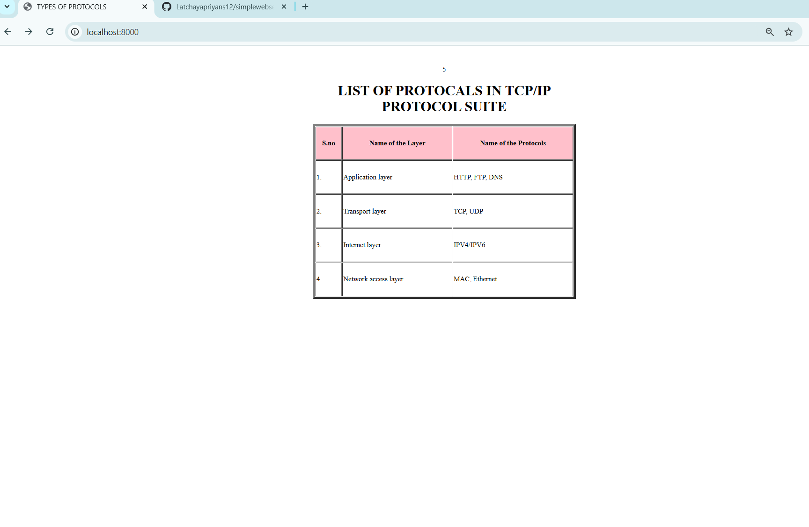

# EX01 Developing a Simple Webserver
## Date:

## AIM:
To develop a simple webserver to serve html pages and display the list of protocols in TCP/IP Protocol Suite.

## DESIGN STEPS:
### Step 1: 
HTML content creation.

### Step 2:
Design of webserver workflow.

### Step 3:
Implementation using Python code.

### Step 4:
Import the necessary modules.

### Step 5:
Define a custom request handler.

### Step 6:
Start an HTTP server on a specific port.

### Step 7:
Run the Python script to serve web pages.

### Step 8:
Serve the HTML pages.

### Step 9:
Start the server script and check for errors.

### Step 10:
Open a browser and navigate to http://127.0.0.1:8000 (or the assigned port).

## PROGRAM:
'''from http.server import HTTPServer, BaseHTTPRequestHandler

content ='''
<!DOCTYPE html>
    <head>
        

        <TITLE> TYPES OF PROTOCOLS</TITLE>

    </head>
    <body>
        
<table border="6" bgcolor="white" WIDTH="600PX" HEIGHT="400PX">

        <caption> <h1>LIST OF PROTOCALS IN TCP/IP PROTOCOL SUITE</h1></caption>
          
        5
            <tr bgcolor="pink">
                <th>S.no</th> <th>Name of the Layer</th> <th>Name of the Protocols</th>
            </tr>
            <tr>
                <td>1.</td> <td>Application layer</td> <td>HTTP, FTP, DNS</td>
            </tr>
            <tr>
                <td>2.</td> <td>Transport layer</td> <td>TCP, UDP</td>
            </tr>
            <tr>
                <td>3.</td> <td>Internet layer</td> <td>IPV4/IPV6</td>
            </tr>
            <tr>
                <td>4.</td> <td>Network access layer</td> <td>MAC, Ethernet</td>
            </tr>
        </table>
    </body>
</html>
'''

class MyServer(BaseHTTPRequestHandler):
    def do_GET(self):
        print("Get request received...")
        self.send_response(200) 
        self.send_header("content-type", "text/html")       
        self.end_headers()
        self.wfile.write(content.encode())

print("This is my webserver") 
server_address =('',8000)
httpd = HTTPServer(server_address,MyServer)
httpd.serve_forever()
'''

## OUTPUT:

## RESULT:
The program for implementing simple webserver is executed successfully.
